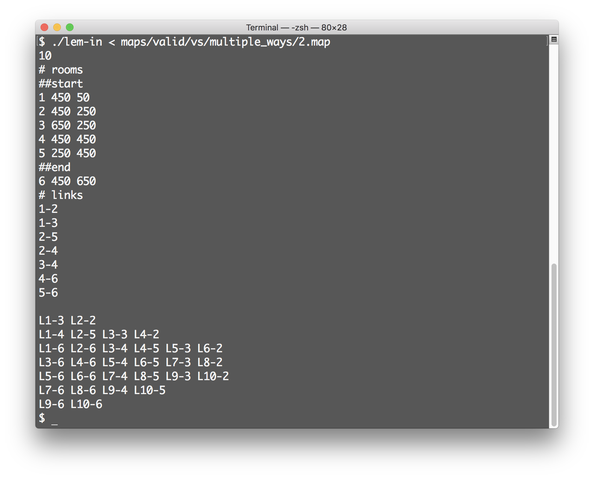

# Lem_in

Lem_in is a School 42 project.

The purpose of this project is to find paths from start room to end room and to move ants by these paths with the least amount of steps.

.png)

[`lem-in.en.pdf`](/lem-in.en.pdf) is the task file.

_**You can check [wiki-page](../../wiki/Algorithm) if you want to read description of created algorithm.**_

### Features

* Find all best paths in most cases
* Move ants by found paths in an optimal way
* Extended error messages
* Verbose mode

### How to run program?

```
./lem-in < MAP_FILE
```



### Verbose mode

Program has **verbose mode**. In this mode program will display paths which were found.

**How to enable verbose mode?**

```
./lem-in -v < MAP_FILE
```

.png)

### Visualizer

Also this project has a visualizer.

It was written with **SDL2** library.

**Prerequisites**

* `brew install SDL2`
* `brew install SDL2_ttf`
* `brew install SDL2_image`
* `brew install SDL2_gfx`

**How to run visualizer?**

```
./lem-in < MAP_FILE | ./vs
```

.png)

**Vector files**

Vector files (.ai) of images, that were used as textures, you can find in [resources/vector](tree/master/resources/vector) folder.

### How to clone?

This repository includes submodule. So if you want to clone it, you can use the following command:

```
git clone --recurse-submodules <repository url>
```

If you will use `git clone <repository url>` instead of, you will get the empty `libft` folder.
